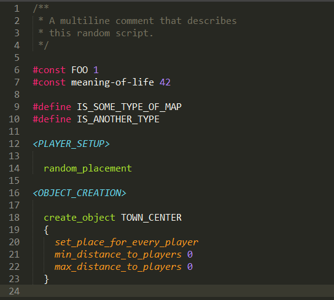

# aoe2-rms

> Age of Empires 2 Random Map Scripting support for VS Code and Sublime Text

## Install

- Visual Studio Code: `Ctrl/Cmd + Shift + X`, then `aoe2-rms`
- Sublime Text (via [Package Control](https://packagecontrol.io/)): `Install Package` in command palette, then `aoe2-rms`

## Release Notes

### 0.1.0

- Added syntax highlighting
